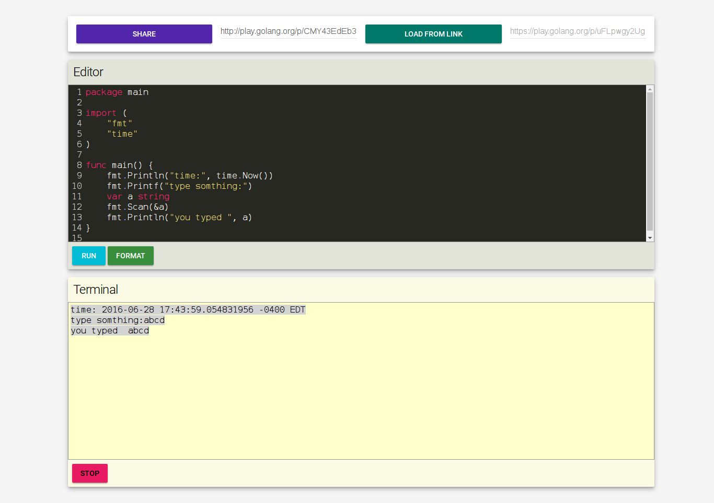

# goEngage
1. runs locally .
2. support for user input and stop exection of program .
3. can import play.golang.org links (ex:https://play.golang.org/p/uFLpwgy2Ug).
4. can export play.golang.org links .

# ScreenShot

# How to Run
1. ``git clone https://github.com/kamilkabir9/goEngage``
2. ``go get ./...``
3. ``PORT=9000 go run server.go ``

# TODO
1. load samples 
2. save named files
3. load named files
4. autocomplete
5. load import from non-stdLib 